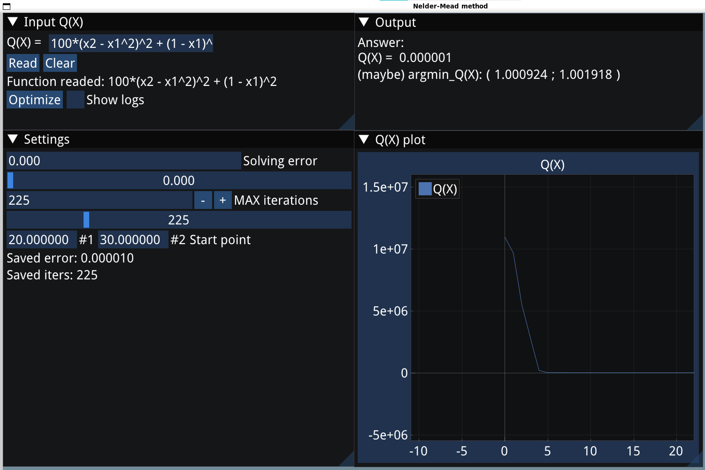
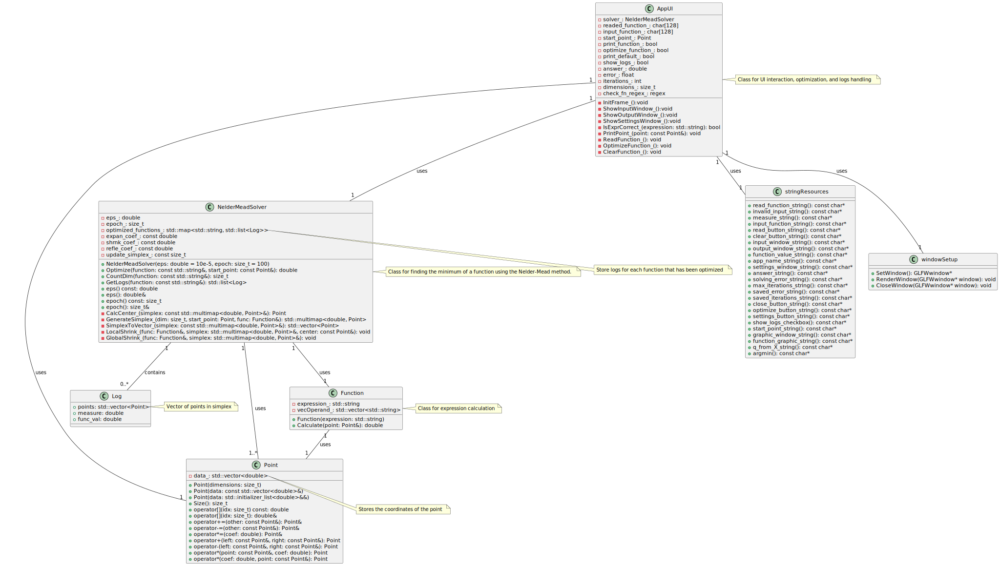

# Nelder-Mead-optimization
Приложение под Linux, оптимизирующее функцию, заданную аналитически, с помощью эвристического алгоритма Нелдера-Мида + [Web версия (запускается в контейнере)](https://github.com/Golubeff-RA/Nelder-web)

# Команда
Голубев Р. - поиск библиотек, CMake (ломаем, потом 3 дня чиним), алгоритм оптимизации.
<br>Пудков М. - frontend, предобработка входящей функции, тестирование.
<br>Самохин В. - алгоритм вычисления функции в точке, критика вычислительной сложности, исправление багов за всеми остальными.
# Запуск в Windows 11
https://cmake.org/download/<br>
https://sourceforge.net/projects/gnuwin32/<br>
https://www.equation.com/servlet/equation.cmd?fa=fortran<br>
Добавьте в переменные окружения (PATH) папку bin из MinGW
``` cmd
mingw-get install mingw32-make
mkdir build
cd build
cmake ../ -G "MinGW Makefiles" -DCMAKE_C_COMPILER="C:/MinGW/bin/gcc.exe" -DCMAKE_CXX_COMPILER="C:/MinGW/bin/g++.exe"
make
cd ../
pip install PyQt5 matplotlib
set QT_DEBUG_PLUGINS=1
python frontend.py
```
# UI
Frontend(UI) нашего приложения написан с помощью открытой библиотеки  [ImGUI](https://github.com/ocornut/imgui). Она достаточно простая и легковесная, по сравнению с Qt Framework. Пока что приложение однопоточное, т. к. оптимизатор работает сравнительно быстро и мы не хотим париться с синхронизацией потоков.

# Алгоритм оптимизации
Для начала оптимизации выбирается стартовая точка, вокруг неё строится симплекс из линейно независимых векторов. Пример старт = (0, 0, 0), симплекс (1, 0, 0), (0, -1, 0), (0, 0, 1) + стартовая (0, 0, 0). Т. е. к координатам стартовой точки прибавляем 1 или -1 (случайно) в каждом измерении. Остановка оптимизации по числу шагов или Евклидовой мере симлекса (объёму). <br> Hint: Каждые 25 шагов (параметр "update_simlex_" в Solver) перестраиваем симлекс, чтобы избежать залипания в очень многомерных функциях.
# Основные классы
Point - обёртка над std::vector для удобной работы с n-мерными точками
``` c++
class Point {
public:
    Point(size_t dimensions);
    Point(const std::vector<double>& data);
    Point(std::initializer_list<double>&& data);

    size_t Size() const;
    double operator[](size_t idx) const;

    double& operator[](size_t idx);

    Point& operator+=(const Point& other);

    Point& operator-=(const Point& other);

    Point& operator*=(double coef);

    friend Point operator+(const Point& left, const Point& right);

    friend Point operator-(const Point& left, const Point& right);

    friend Point operator*(const Point& point, double coef);

    friend Point operator*(double coef, const Point& point);


private:
    std::vector<double> data_;
};
```
Function - переводит исходную строку функции в польскую запись при создании и считает значение в точке с помощью метода Calculate.
```c++
namespace FR {
class Function {
private:
    std::string expression_;
    std::vector<std::string> vecOperand_;

public:
    Function(const std::string expression);
    double Calculate(const Point& point);
};
}  // namespace FR
```
NelderMeadSolver - оптимизатор, в котором и реализован сам алгоритм Нелдера-Мида.
``` c++
namespace SLV {
using Simplex = std::multimap<double, Point>;

class NelderMeadSolver {
public:
    NelderMeadSolver(LoggerPtr log_ptr, double expan_coef_ = 2, double shrnk_coef = 0.5,
                     double refle_coef = 1, size_t update_simplex = 25);
    // вернёт найденный минимум функции стартуя с заданной точки
    double Optimize(const OptInfo& info);
    // вернёт строчку с гиперпараметрами оптимизации
    std::string GetHyperparams() const;
    // считает число переменных в оптимизируемой функции
    static size_t CountDim(const std::string& function);

private:
    const LoggerPtr log_ptr_;
    const double expan_coef_;
    const double shrnk_coef_;
    const double refle_coef_;
    const size_t update_simplex_;

    // вычисляет центр "лучших" точек симплекса
    Point CalcCenter_(const Simplex& simplex);

    // генерирует опорный симплекс
    Simplex GenerateSimplex_(size_t dim, Point start_point, FR::Function& func);

    // преобразует симплекс в вектор точек
    std::vector<Point> SimplexToVector_(const Simplex& simplex);

    // оператор локального сжатия
    void LocalShrink_(FR::Function& func, Simplex& simplex, const Point& center);

    // оператор глобального сжатия всего симплекса
    void GlobalShrink_(FR::Function& func, Simplex& simplex);
};

}  // namespace SLV
```
Logger - объект который хранит последнюю оптимизацию каждого NelderMeadSolver, также умеет создавать подобие сайта, на котором хранится история всех оптимизаций. 
``` c++
namespace SLV {
namespace ch = std::chrono;
namespace fs = std::filesystem;

using TimePoint = std::chrono::system_clock::time_point;

class Logger;
class NelderMeadSolver;

using LoggerPtr = std::shared_ptr<Logger>;

struct Log {
    double func_val;
    double measure;
    Point best_point;
};

struct OptInfo {
    std::string function;
    size_t epoch;
    double measure;
    Point start_point;
};

using LogList = std::list<Log>;

struct Optimization {
    OptInfo info;
    LogList logs;
};

std::string TimePointToStr(const TimePoint& tp);

class Logger {
public:
    static LoggerPtr GetLogger();
    Logger(const Logger&) = delete;
    Logger& operator=(const Logger&) = delete;
    LogList GetLogs(const NelderMeadSolver* solver);
    void SaveLogs(const OptInfo& info, const std::list<Log>& logs, const NelderMeadSolver* solver);
    void WriteHTML(const NelderMeadSolver* solver);

private:
    size_t counter{0};
    fs::path subdir_path;
    static LoggerPtr instance;
    static std::once_flag init_flag;
    const fs::path parent_path{"optimization_logs"};
    std::map<const NelderMeadSolver*, Optimization> last_optimizations;

    Logger();

    void WriteIndexHTML_();
    void WriteHead_(std::ostream& out);
    void WritePoint_(std::ostream& out, const Point& p);
    void WriteLogs_(std::ostream& out, const LogList& logs);
    void WriteAnswer_(std::ostream& out, const LogList& logs);
    void WriteOptInfo_(std::ostream& out, const OptInfo& info);
    void UpdateIndexHtml_(fs::path new_file, const OptInfo& info, const NelderMeadSolver* solver);
};

inline LoggerPtr Logger::instance = nullptr;
inline std::once_flag Logger::init_flag;
}  // namespace SLV

```
# UML-диаграмма
